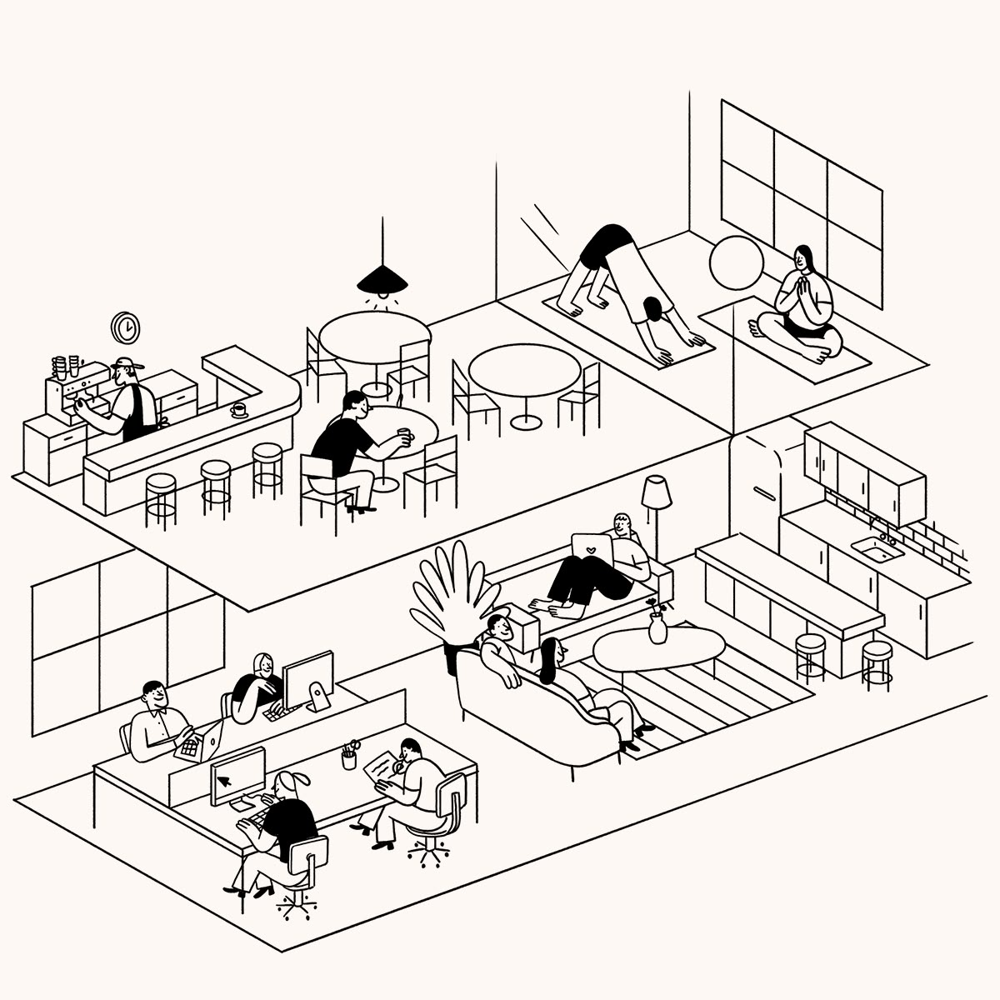
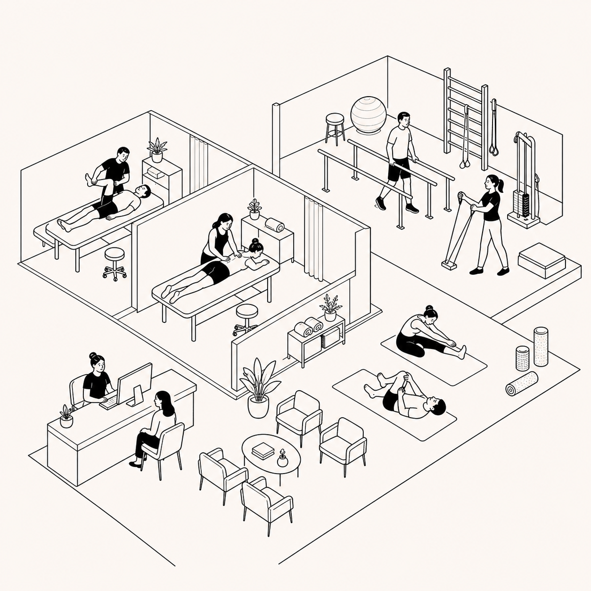
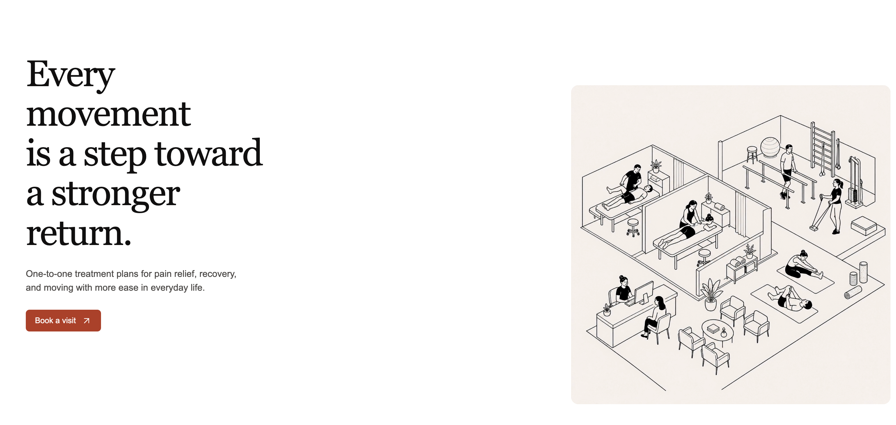
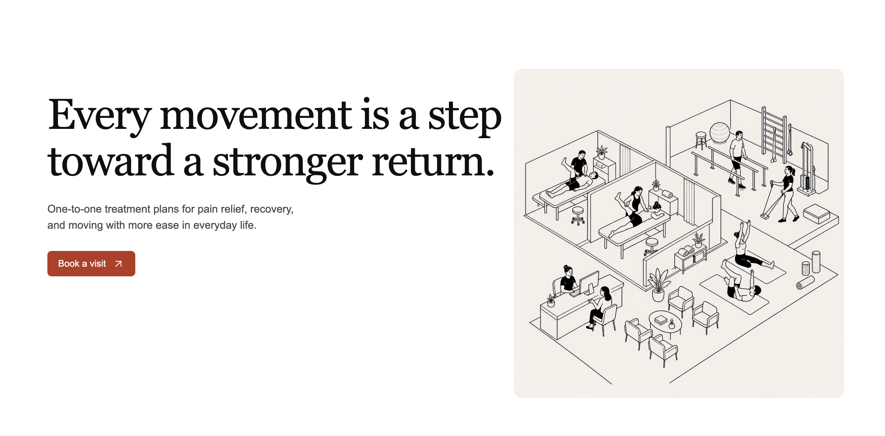
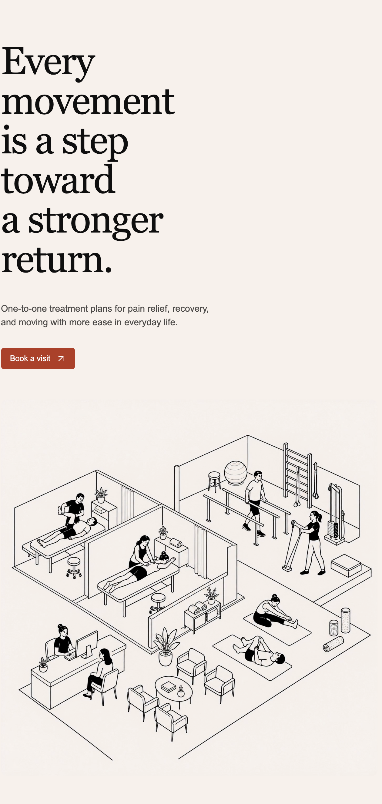

# Physiotherapy clinic — conversation transcripts

ompt, and landing-page hero. Images are embedded below and retained in the adjacent `assets/` folder.

## 1. Illustration and looping animation

**Title:** Plan physiotherapy clinic image

### Conversation — 2026-07-19

#### User

# Files mentioned by the user:

## Request:
Generate an image like this but for a physiotherapy clinic. FIrst tell me the ideas before creating

#### Assistant

I’m using the image-generation workflow to shape a concept that keeps the reference’s elegant isometric line-art feel, while making the clinic unmistakably physiotherapy-focused.

#### Assistant

Here are three strong directions that keep the reference’s clean, isometric black-line illustration style:

1. **Complete clinic overview** — a cutaway floor plan with reception, treatment beds, a rehab gym, consultation room, and recovery/stretching corner. Patients use resistance bands, balance balls, parallel bars, and exercise bikes.

2. **Recovery in motion** — a more energetic version centered on therapists guiding patients through mobility work: assisted walking, shoulder-band exercises, core strengthening, and posture training.

emium clinic** — a spacious, minimal clinic scene with fewer people, warm off-white background, treatment rooms, plants, and carefully arranged rehabilitation equipment. More editorial and upscale.

My recommendation: **Complete clinic overview**. It maps most naturally to your reference while instantly communicating “physiotherapy clinic.”

efer, and I’ll create it.

### Conversation — 2026-07-19

#### User

do the first. I want the image to be the exact style as the image I shared

#### Assistant

I’ll create the complete clinic overview, using your image as the style and composition reference: the same sparse monochrome isometric linework, creamy background, fine black outlines, and selective solid-black clothing accents—without any text or logos.

#### Image generated
ompt**

Use case: stylized-concept
eview
ecise black ink outlines on a warm cream/off-white background, with a few solid-black clothing accents. The reference image is style and composition guidance.
Input images: Image 1: reference image for exact overall illustration style, line weight, isometric perspective, whitespace, and monochrome palette.
Scene/backdrop: a single coherent physiotherapy clinic shown as an open isometric floor plan, no exterior walls needed except light architectural hints.
iate and friendly.
essive people; delicate hand-drawn ink quality.
Composition/framing: high-angle isometric three-quarter view, balanced modular room zones similar to the reference, generous cream negative space around the clinic, square image.
emium healthcare environment.
Color palette: warm ivory background, black outlines, white/cream interiors, very sparse solid-black garments.
Constraints: clinic objects must clearly read as physiotherapy equipment; distinct zones must remain tidy and legible; all people fully visible; no signage, no written words, no logo, no watermark; do not use photorealism, color illustrations, 3D rendering, heavy shadows, sketchy clutter, or thick cartoon outlines.

#### Assistant

The illustration is generated with the requested clinic layout: reception and waiting lounge, two treatment bays, parallel bars and resistance training, plus an open stretching area. I’m saving a copy as a deliverable now.

#### Assistant

### Conversation — 2026-07-19

#### User

I want to animate this in higgsfield using seedance 2.0

ompt for that. Fixed camera - no zooming or pannign
Show the different parts of the image animated like the physiotehray treameants, people exercising, walking etc. talking etc. 
people do it being in their own place and the movement is kind of like a loop for each so that I can use this as a looping video

#### Assistant

:::writing{variant="standard" id="18427"}
Create a seamless looping animation from the supplied isometric physiotherapy clinic illustration.

eserve the exact monochrome cream-and-black line-art style, clean isometric layout, and all furniture, walls, and equipment in their original positions.

Animate each clinic zone independently with subtle, natural, repeating actions:

- In the treatment bays, physiotherapists make gentle repeated treatment motions while patients subtly move an arm or leg.
- At the parallel bars, one patient takes slow, steady steps back and forth in place, returning smoothly to the start pose.
- In the exercise area, a patient performs a controlled resistance-band pull-and-release loop.
- In the stretching area, patients repeat slow seated stretches and gentle knee-to-chest movements.
- At reception, the receptionist types lightly while the visitor makes small conversational gestures and nods.
- In the waiting area, seated people shift posture slightly, gesture softly while talking, and occasionally nod.

oportions, floor plan, negative space, and visual simplicity unchanged. No text, no logos, no extra objects, no flicker, no morphing, no camera motion.
:::

For a clean loop, set the duration to around 6–8 seconds and enable seamless looping if Seedance offers it.

---

## 2. Movewell physiotherapy landing-page hero

**Title:** Create physiotherapy clinic hero

### Conversation — 2026-07-21

#### User

I want to create a single page, basically just the hero section for a new page I want to show a friend.
He is having a physiotherapy clinic and wants to create a website.

I just need a home page. and on right side show the video I am attaching below
public/client/physio

We can also give the clinic a name and also add a nav bar and a main CTA

This is a website I liked https://www.amigo.ai/
We can pick most of the design detail of its home page from this, the items in nav bar etc
I also want to use that font in this website if that an open font. And I want to use this font for jus this page and not added globablly, maybe import using link?

Now let me share few physio website for some content inspiration:
1. https://drspine.in/physiotherapist-in-bangalore/
2. https://cbphysiotherapy.in/
3. https://reliva.in/physiotherapy-clinics/bengaluru/
4. https://resolve360.app/
All of these are only for content and nothing else.

First do all the analysis then comeback and ask me any questions you have

#### Assistant

I’ll first inspect the existing app and the supplied clinic video, then study the referenced visual direction and content sources. I’ll keep this to analysis only and come back with the few choices that materially shape the page.

#### Assistant

I found two supplied hero-video variants (`physio_main.mp4` and `physio_main_v2.mp4`) and confirmed this is an existing Next.js App Router site. I’m using the website-inspiration capture guidance because the visual reference needs to be translated into an original, implementable direction.

#### Assistant

omise around pain relief, movement recovery, and personalised care.

oduction font from its public markup, so the plan should deliberately choose a page-scoped open alternative rather than assume it is reusable.

#### Assistant

eview brand and design the CTA as WhatsApp-first. I’ll make one more pass to identify Amigo’s font from public technical signals; if it is a commercial font, I’ll give you the exact name so you can decide whether to license it or choose a close Google Font.

#### Assistant

eviewing options; I’ll wire that font only into the physio page, leaving the rest of the site untouched.

#### Assistant

The two video variants appear visually equivalent in their opening frame: a square, warm-white line illustration of a complete physiotherapy clinic. I’ll default to `physio_main_v2.mp4` as the hero media, with autoplay/muted/loop and a still first frame so it feels deliberate rather than like a generic stock clip.

#### Assistant

Analysis complete.

- Amigo’s exact headline font is **Flecha S**, but it is not openly reusable; choose and send a Google Font link, and I’ll scope it to this page only.
- I’ll use **Movewell Physio** and default to `physio_main_v2.mp4`.
- The hero will use an original warm, editorial healthcare direction inspired by Amigo’s spacing and hierarchy—not a copy.

Please send:

1. The clinic’s WhatsApp number, including country code (for the live CTA).
2. Your chosen Google Font link/name.
eview-only links, anchor links with small sections below, or minimal logo + CTA.
4. Hero tone: warm recovery, clinical expertise, or sports performance.

### Conversation — 2026-07-21

#### User

also create a small logo mark somthing similar to that amigo logo for our clinic?

#### Assistant

Yes—I'll add a compact, original Movewell logo mark that echoes the reference’s confident minimalism without copying it. I’m using the image-generation guidance to define how that mark should be created, but will keep this turn to planning until the page spec is locked.

#### Assistant

Great choice. I’ll use an original **motion-monogram**: two clean, flowing arcs that suggest an “M”, movement, and recovery—implemented as a sharp inline SVG, not a copied Amigo asset.

Still needed before I can lock the implementation plan:

- Google Font link/name
- WhatsApp number with country code

eview-only nav and warm-recovery messaging.

### Conversation — 2026-07-21

#### User

also for font use this

econnect" href="https://fonts.googleapis.com">
econnect" href="https://fonts.gstatic.com" crossorigin>
<link href="https://fonts.googleapis.com/css2?family=DM+Sans:ital,opsz,wght@0,9..40,100..1000;1,9..40,100..1000&display=swap" rel="stylesheet">

Right now no need to make the CTA clickable. so no whatsapp number

#### Assistant

eview element.

One placement decision remains: the current `/` page is an existing gallery, so I need to know whether this clinic concept should replace it or live at its own route.

### Conversation — 2026-07-21

#### User

PLEASE IMPLEMENT THIS PLAN:
eview at `/client/physio`

## Summary

eserving the existing UiGlow home page. It will use an original, Amigo-inspired editorial layout: compact navigation, warm recovery-led messaging, an original motion-monogram, and the supplied clinic animation on the right.

## Implementation Changes

- Add a page-specific route and styling for `/client/physio`; load the supplied DM Sans Google Font links there and apply it only within the Movewell page wrapper.
- Build a calm warm-white / deep-ink visual system with restrained borders, generous whitespace, and a small inline-SVG motion monogram: two flowing arcs that imply an “M” and physical movement.
oach`—plus a visible but intentionally non-clickable `Book an appointment` CTA.
- Use recovery-focused content: a short eyebrow, a bold movement-and-confidence headline, supportive personalised-care copy, and concise treatment highlights.
- Place `public/client/physio/physio_main_v2.mp4` in a rounded, lightly framed right-side media panel with muted autoplay, looping, inline playback, and responsive sizing. Stack it below the copy on small screens.
- Include page metadata for Movewell Physio without changing the site-wide title/description.

## Test Plan

- Confirm `/client/physio` renders without affecting `/`.
- Verify the video loads, plays silently, loops, and remains contained at desktop and mobile sizes.
esent but do not navigate, and the layout remains usable at narrow viewport widths.

## Assumptions

- Brand name: **Movewell Physio**.
- Hero tone: warm, human recovery—not sports-first or overly clinical.
eview until a booking destination is supplied.
- The page uses `physio_main_v2.mp4`; no external logo/image asset is needed because the logo is original inline SVG.

#### Assistant

oject’s Next.js conventions, then build and visually check the new page at desktop and mobile widths.

#### Assistant

esents as a clean standalone client site.

#### Assistant

#### Assistant

eview it.

#### Assistant

e-existing and unrelated. I’m doing a browser-level layout check next.

#### Assistant

_Tool step completed: js (completed)._
#### Assistant

_Tool step completed: js (completed)._
#### Assistant

_Tool step completed: js (completed)._
#### Assistant

_Tool step completed: js (completed)._
#### Assistant

_Tool step completed: js (completed)._
#### Assistant

_Tool step completed: js (completed)._
#### Assistant

_Tool step completed: js (completed)._
#### Assistant

_Tool step completed: js (completed)._
#### Assistant

_Tool step completed: js (completed)._
#### Assistant

_Tool step completed: js (completed)._
#### Assistant

_Tool step completed: js (completed)._
#### Assistant

Desktop and mobile checks both pass: the page has no framework overlay or console errors, the video has the requested playback attributes, and the mobile layout correctly stacks the animation beneath the content. I’m doing the final route-isolation check and then I’ll hand it over.

#### Assistant

_Tool step completed: js (completed)._
#### Assistant

- Verified desktop/mobile rendering, video attributes, no console errors or framework overlays, and confirmed the existing `/` page still renders.
- `npm run build` passes. The sole new warning is expected: Next notes that the Google Font is route-only.

### Conversation — 2026-07-21

#### Assistant

etation, not a close match. I’ll rework it around Amigo’s actual visual system: its layout rhythm, dark teal/warm-neutral palette, display typography treatment, button geometry, and hero composition—while keeping Movewell’s own content, mark, and supplied clinic video.

#### Assistant

_Tool step completed: js (completed)._
#### Assistant

_Tool step completed: js (completed)._
#### Assistant

_Tool step completed: js (completed)._
#### Assistant

I’ve measured the live reference rather than guessing: pure white canvas, near-black `#100f0f`, Amigo’s terracotta `#aa412a`, 6px CTA radius, Inter UI at 13px/500, and a 54px lightweight serif headline in a deliberately sparse 30/70 hero grid. I’m now replacing the extra decorative content and rounded-card treatment with that structure.

#### Assistant

#### Assistant

#### Assistant

_Tool step completed: js (completed)._
#### Assistant

_Tool step completed: js (completed)._
#### Assistant

The reference comparison surfaced two concrete geometry differences in my first pass: the clinic headline needs Amigo’s four-line display rhythm, and the media needs to sit wider and lower in the hero. I’m correcting both against the live measurements now; this is the difference between “inspired by” and the specific composition you asked for.

#### Assistant

#### Assistant

_Tool step completed: js (completed)._
#### Assistant

#### Assistant

_Tool step completed: js (completed)._
#### Assistant

The desktop composition now matches the reference’s measured hero geometry closely. The first mobile capture returned blank despite the page’s DOM and video health checks succeeding, so I’m rerunning that check in a fresh mobile tab before I call this finished.

#### Assistant

_Tool step completed: js (completed)._
#### Assistant

ocess and rerunning the build cleanly.

#### Assistant

The revised page now follows the reference’s actual first-fold structure instead of a generic clinic layout: bare white canvas, tightly centered navigation, terracotta 6px CTA, four-line display headline, and the wide rounded media panel positioned on the same visual axis. Desktop and mobile now render correctly, and the static build passes.

#### Assistant

Rebuilt `/client/physio` around Amigo’s actual hero system.

- White canvas, near-black text, Amigo’s `#aa412a` CTA, 6px corners, nav spacing, sparse 30/70 hero grid, and wide rounded media composition now match the reference.
evious extra clinic-style sections, pills, borders, and copy that made it feel generic.
ietary Flecha S; DM Sans remains the UI font.
- Verified desktop/mobile rendering, video playback, no browser errors, and a successful static build.

### Conversation — 2026-07-21

#### Assistant

ior pass as “close enough.”

#### Assistant

#### Assistant

eview for the final comparison.

#### User

## Request:
ok few changes:

make the image on right side a square as that its original size
and make it bit more smaller.
Also reduce the rounding of corners.

We also need some more content on the left side

#### Assistant

eview booking CTA beneath the headline.

#### Assistant

#### Assistant

The layout now keeps the clinic illustration intact at its native square ratio, scaled down and sharpened to a 12px radius. I’ve added the left-side clinical context without turning it back into the crowded first version.

#### Assistant

_Tool step completed: js (failed)._
#### Assistant

eview tab only to confirm the new square media dimensions and supporting content.

#### Assistant

_Tool step completed: js (completed)._
#### Assistant

_Tool step completed: js (completed)._
#### User

## Request:
instead of 5 lines make the heading 3 lines

Remove the personliased physio care text

#### Assistant

eserving the added supporting copy and booking CTA.

#### Assistant

#### Assistant

The content has been removed and the headline is now explicitly structured as three lines. I’m running the build once more to confirm the simplified hero export is clean.

#### Assistant

Updated `/client/physio`:

- Heading is now three lines.
- Removed “Personalised physiotherapy care.”
eserved the supporting paragraph and booking CTA.
- Build passes successfully.

### Conversation — 2026-07-21

#### Assistant

eview to ensure the new three-line heading has not wrapped unexpectedly at the active desktop width.

#### Assistant

_Tool step completed: js (failed)._
#### Assistant

_Tool step completed: js (failed)._
#### Assistant

_Tool step completed: js (failed)._
#### Assistant

_Tool step completed: js (completed)._
#### Assistant

ior five-line treatment. The eyebrow text is removed; the build remains green.

### Conversation — 2026-07-21

#### Assistant

I’m tightening the implementation so the three-line treatment is guaranteed by the layout itself, not merely suggested by ` ` tags that could still wrap at a particular width.

#### Assistant

#### User

# Files mentioned by the user:

## Request:
operly aligned. lot of space between etc fix all of these.

#### Assistant

 to the far edge of an oversized grid while the display copy was constrained to a narrow column, which created the empty gulf and forced the heading to break poorly. I’m rebalancing the grid, removing the old positional offsets, and using a genuinely three-line headline that fits its column.

#### Assistant

#### User

## Request:
I think we can do 2 lines

#### Assistant

Agreed—two lines will make the left column feel deliberate and let the supporting copy do its job. I’ll shorten the headline rather than squeezing the existing sentence into an awkward two-line wrap.

#### Assistant

#### Assistant

_Tool step completed: js (completed)._
#### Assistant

I found the remaining cause: the hero was vertically centering itself inside every available viewport, so on a tall screen it drifted far down the page. I’m switching it to a deliberate top-aligned composition—matching Amigo’s fixed first-fold rhythm—so the headline and square visual begin together instead of floating in a large empty field.

#### Assistant

#### Assistant

_Tool step completed: js (completed)._
#### Assistant

eview is now top-aligned and balanced: the text block and square illustration share the same visual start, and the excessive vertical gap is gone. I’m running the final static build with this layout.

#### Assistant

Fixed the layout structure:

- Replaced the oversized 3-line headline with a clean two-line version.
 to the far edge.
- Removed the vertical centering that caused the hero to float far down on taller screens.
- Aligned the text block and square illustration at the same starting position.
- Build passes.

### Conversation — 2026-07-21

#### Assistant

The revised hero is in place and the build is clean. I’m keeping the reference styling direction intact for the next refinement.

### Conversation — 2026-07-21

#### Assistant

No additional change requested.

### Conversation — 2026-07-21

#### Assistant

The reference-led hero work is complete: the remaining intentional differences are the clinic’s own brand, copy, and square media treatment that you requested.

#### User

## Request:
the overall content is left alinged

#### Assistant

ession without turning the content into centered marketing text.

#### Assistant

#### Assistant

_Tool step completed: js (completed)._
#### Assistant

eserving left-aligned copy inside it. The heading, supporting text, CTA, and square visual now sit as one balanced group instead of hugging the page’s left edge.

### Conversation — 2026-07-21

#### User

## Request:
evious heading., the longer one, but make that into two lines

#### Assistant

I’ll restore the longer recovery message and re-balance the desktop columns so it genuinely fits as two display lines, without making the square illustration large again.

#### Assistant

#### Assistant

_Tool step completed: js (completed)._
#### Assistant

oduction build now rather than assuming the latest CSS change is safe.

#### Assistant

eview check of the updated two-line heading now.

#### Assistant

_Tool step completed: js (completed)._
#### Assistant

Restored the longer recovery headline as two clean lines:

“Every movement is a step”  
“toward a stronger return.”

eview now renders successfully.

### Conversation — 2026-07-21

#### User

## Request:
the image on right side. its by default had a white bg. do that and remove the new background color we added

#### Assistant

I’ll remove the added warm card fill so the square video sits on its own original white background, without a competing panel color behind it.

#### Assistant

#### Assistant

Removed the added warm background from the video frame. The right-side media now uses its original white background only.

### Conversation — 2026-07-21

#### User

# Files mentioned by the user:

## Request:
oper. no spacing between

operly. The heading can also go into three lines.

#### Assistant

I see the issue in the screenshot: the long two-line headline consumes the entire left column, visually colliding with the image. I’m switching back to a three-line editorial headline and giving the two columns a fixed, intentional gap; I’ll also open up the space between the headline, description, and CTA.

#### Assistant

#### Assistant

_Tool step completed: js (completed)._
#### Assistant

Rebuilt the hero spacing:

- Long heading is now a deliberate three-line composition.
- Added a fixed 100px desktop gutter between text and illustration.
- Set stable column widths so the headline cannot crowd the media.
- Increased spacing before the supporting copy and CTA.

operly separated, balanced layout.

### Conversation — 2026-07-21

#### User

## Request:
make the background color to #F8F1EC

#### Assistant

I’ll apply `#F8F1EC` to the page canvas only, keeping the clinic video’s original white background unchanged.

#### Assistant

#### Assistant

Updated the page background to `#F8F1EC`, while leaving the video’s white background intact.

### Conversation — 2026-07-21

#### User

## Request:
can you look at the bg color of the video and see what that is and match the canvas color to that

#### Assistant

I’ll sample the supplied video’s own background rather than eyeballing it, then set the canvas to that exact value.

#### Assistant

#### Assistant

Sampled the video’s background corners: the matching color is `#F7F1EC`.

Updated the page canvas to that exact value.

### Conversation — 2026-07-21

#### User

## Request:
also change the video to the other video in the folder

#### Assistant

I’ll switch the hero to the other supplied clinic animation while keeping the matched canvas color and layout unchanged.

#### Assistant

#### Assistant

Switched the hero to `physio_main.mp4`.

### Conversation — 2026-07-21

#### User

## Request:
Can you make the video bit more larger

#### Assistant

esence without crowding the left column again.

#### Assistant

#### Assistant

Made the hero video larger, increasing its desktop maximum from 460px to 520px while retaining an 80px gap from the copy.

### Conversation — 2026-07-21

#### User

## Request:
now for the background I want to try out some 
Lets use a dither background

Very subtle and mostly on corners

#### Assistant

I’ll reuse the supplied dither treatment as a subtle page-layer effect, concentrating it at the outer corners so the hero remains clean and legible.

#### Assistant

The referenced component is a shader-generated dot field, but this page does not include the Remotion/Three runtime it depends on. I’m translating the same visual idea into a lightweight CSS dither layer: fine warm dots, softly masked to the top-left and bottom-right corners, with a barely perceptible drift.

#### Assistant

#### Assistant

#### Assistant

_Tool step completed: js (completed)._
#### Assistant

Added a lightweight dither background inspired by the supplied shader:

- Fine warm terracotta dot field.
- Softly masked to the top-left and bottom-right corners.
- Very low opacity with a slow, subtle drift.
- Hero content remains above it and fully readable.

### Conversation — 2026-07-21

#### User

## Request:

### Conversation — 2026-07-21

#### User

# Files mentioned by the user:

## Request:
on mobile can the video be on top and everything else below

Also center align text on mobile

#### Assistant

 you requested.

#### Assistant

#### Assistant

_Tool step completed: js (completed)._
#### Assistant

 now.

#### Assistant

 next.

#### Assistant

.

- Video appears first on mobile; all copy and CTAs are centered beneath it.

---

## 3. Higgsfield animation production notes

### Animation prompt

Create a seamless looping animation from the supplied isometric physiotherapy clinic illustration.

Keep the camera completely fixed: no zoom, pan, tilt, rotation, reframing, or perspective shift. Preserve the exact monochrome cream-and-black line-art style, clean isometric layout, and all furniture, walls, and equipment in their original positions.

Animate each clinic zone independently with subtle, natural, repeating actions:

- In the treatment bays, physiotherapists make gentle repeated treatment motions while patients subtly move an arm or leg.
- At the parallel bars, one patient takes slow, steady steps back and forth in place, returning smoothly to the start pose.
- In the exercise area, a patient performs a controlled resistance-band pull-and-release loop.
- In the stretching area, patients repeat slow seated stretches and gentle knee-to-chest movements.
- At reception, the receptionist types lightly while the visitor makes small conversational gestures and nods.
- In the waiting area, seated people shift posture slightly, gesture softly while talking, and occasionally nod.

Every person remains in their own designated area; no one walks between rooms or overlaps another person. Motions should be calm, medically appropriate, subtle, and synchronized as short repeatable loops. Keep line weights, proportions, floor plan, negative space, and visual simplicity unchanged. No text, no logos, no extra objects, no flicker, no morphing, no camera motion.

### First render

The initial clip used an 8-second, 1:1, 1080p seamless loop. The illustration was pinned as the first and last frame so it closes cleanly. The camera stayed locked, the cream-and-black line art stayed unchanged, and each zone followed an independent loop. A faint clinic room tone was included, with no music or speech.

### Revision request

- Keep the parallel-bars walker and resistance-band exercise at their existing pace.
- Make only selected treatment-bay motions a little faster.
- Make the two lying patients’ movements smoother.
- Fix an extra third-leg artifact on the left-side lying patient.
- Make the adjacent hand-extension movement smooth and regular.

### Revised animation direction

- Apply a strict anatomy lock: each person retains exactly two arms and two legs; no duplicated or merged limbs.
- Animate the hand extension as one smooth, constant-speed arc out and back along the same path, with both arms moving together.
- Use continuous, eased starts and stops for the two lying patients’ limb movements.
- Slightly increase the tempo of treatment-bay motions only; retain the original tempo for the parallel-bars walker and resistance-band exercise.
- Preserve the seamless loop, fixed camera, and unchanged line-art style.

---

## Included files

- `assets/physiotherapy-clinic-illustration.png` — generated isometric clinic illustration
- `assets/reference-01.png`, `assets/reference-02.png`, `assets/reference-03.png` — images shared in the landing-page conversation
- `assets/mobile-layout-request.png` — mobile-layout screenshot shared in the landing-page conversation

